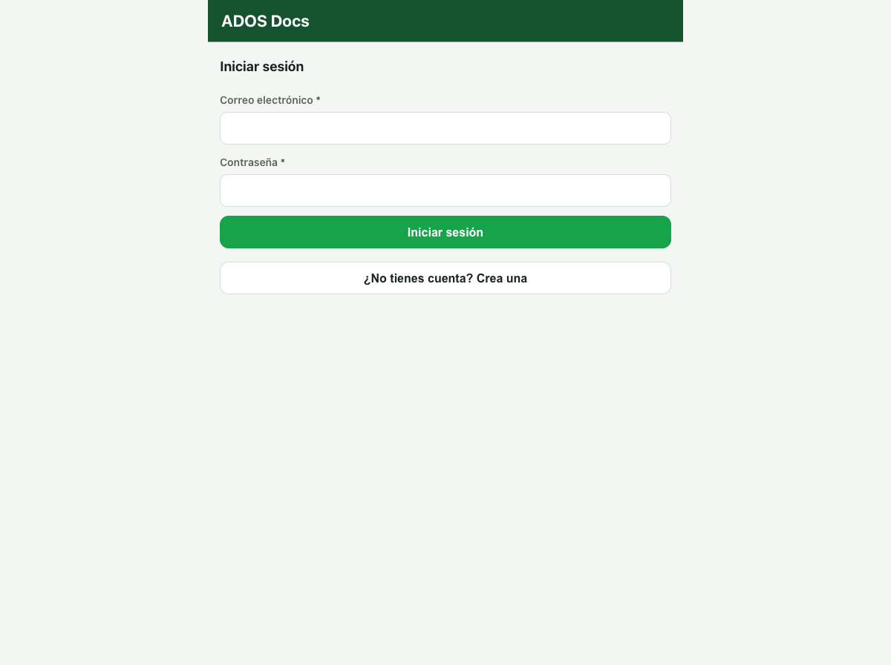
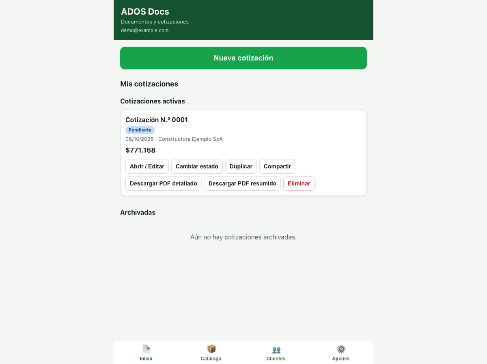
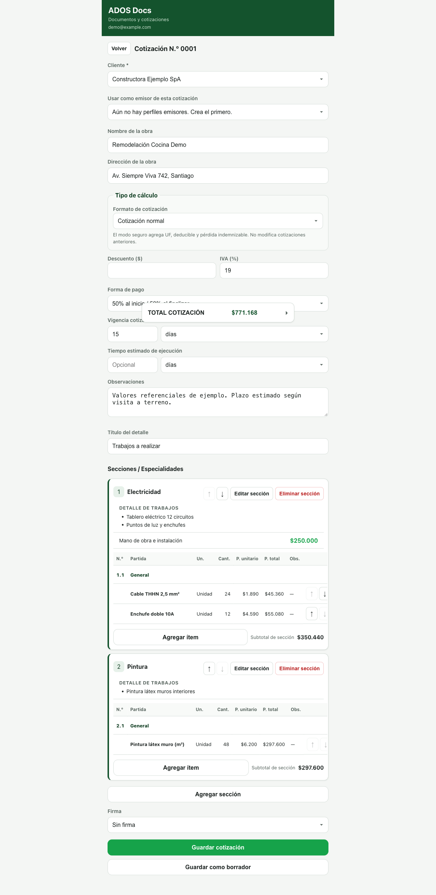
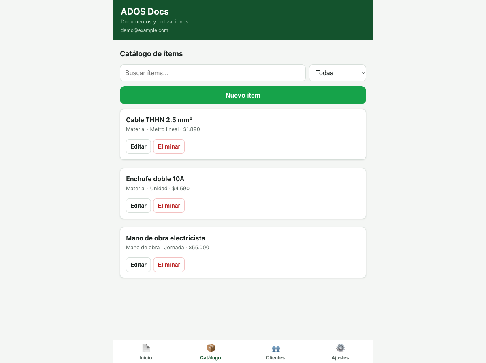
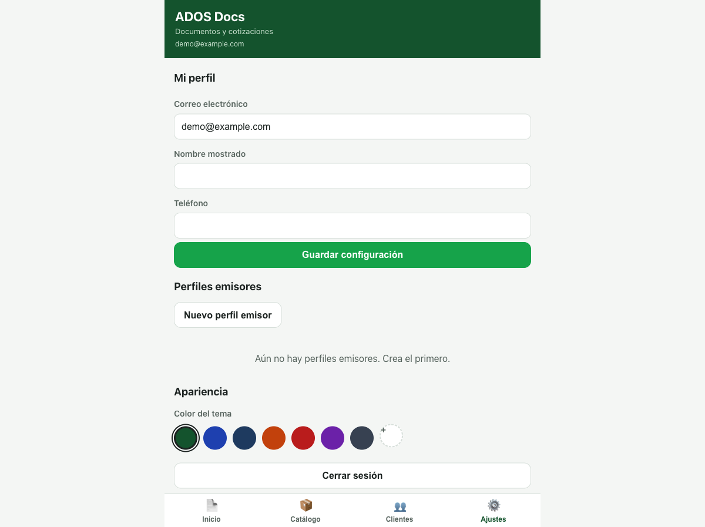

# ADOS Docs

[](LICENSE)

> **Descriptor:** *Open-source document workspace*.

**ADOS Docs** es una PWA en español para crear, ajustar, guardar y compartir
**cotizaciones de construcción en CLP**: clientes, secciones, partidas, cálculos
explicables y exportación a PDF (detallado y resumen).

Sin framework: **Vite + TypeScript**. Capas separadas en `domain` (lógica pura),
`firebase` (Authentication + Cloud Firestore por usuario), `pdf` e `ui`.

> **Nombre histórico.** El proyecto nació como *ADOS Obras*; el producto hoy se
> llama **ADOS Docs**. Los documentos de especificación de las primeras fases
> conservan el nombre original como registro histórico.

## Características

- Cotizaciones con clientes, secciones jerárquicas y partidas.
- Cálculos automáticos y trazables: subtotales, totales, seguro y forma de pago.
- Dos formatos de exportación PDF: detallado y resumen, con numeración propia.
- Perfiles emisores por usuario (empresa o persona natural); cada cotización
  congela un snapshot inmutable del emisor.
- Multiusuario con Firebase Auth (correo y contraseña) y Cloud Firestore, con
  datos aislados por `users/{uid}/**` y reglas de seguridad verificadas por tests.
- PWA instalable: manifest, iconos y service worker con precache en build de
  producción.
- Persistencia local de respaldo (localStorage) para no perder datos previos a la
  sesión conectada.
  - Interfaz en español, pensada para teléfono y escritorio, con objetivo de
    accesibilidad WCAG 2.1 AA (ver `PRODUCT.md`).

## Capturas

Capturas reales de la aplicación ejecutándose en local con los emuladores de
Firebase y un proyecto de demostración (`demo-*`), usando datos de ejemplo. No
provienen de ningún entorno de producción.

| Inicio de sesión | Mis cotizaciones |
| --- | --- |
|  |  |

| Editor de cotización | Catálogo de ítems |
| --- | --- |
|  |  |

| Ajustes y perfil |
| --- |
|  |

## Estado

Proyecto en desarrollo activo y funcional para su alcance actual (cotizaciones).
La especificación viva está en [`openspec/`](openspec) y la definición de
producto en [`PRODUCT.md`](PRODUCT.md). Todas las mejoras se plantean como
cambios especs antes de implementarse (ver *Flujo de trabajo*).

## Stack

| Área | Tecnología |
| --- | --- |
| Build y dev server | Vite + TypeScript (estricto, `tsc --noEmit`) |
| Lógica de negocio | TypeScript puro, sin dependencias de red |
| Backend | Firebase Authentication + Cloud Firestore (proyecto propio) |
| PDF | jsPDF + jspdf-autotable |
| Lint | ESLint 10 + typescript-eslint |
| Pruebas | `node:test` (dominio y seguridad), emuladores de Firebase (reglas y UI) |
| CI | GitHub Actions (solo gates locales, sin credenciales) |

## Requisitos

- Node.js 20.19+ (o 22.13+/24+) y npm.
- Una cuenta de [Firebase](https://console.firebase.google.com) propia, solo si
  quieres usar la app con datos reales.
- JDK 17+ (solo para las pruebas que arrancan el emulador de Firestore).

`firebase-tools` es una devDependency: se instala con `npm ci`, no hace falta
instalarlo globalmente.

## Puesta en marcha

```bash
npm install
cp .env.example .env.local
npm run dev
```

Rellena `.env.local` con los datos de **tu** proyecto Firebase:

1. Crea el proyecto en la consola de Firebase.
2. Habilita **Authentication → Inicio de sesión con correo y contraseña**.
3. Crea **Cloud Firestore** (p. ej. región Santiago).
4. Añade una **app web** y copia su `firebaseConfig`.

Tus datos viven en tu proyecto: el código de este repositorio no apunta a ningún
proyecto predefinido y `.firebaserc` no está versionado a propósito.

## Scripts

| Script | Qué hace |
| --- | --- |
| `npm run dev` | Servidor de desarrollo |
| `npm run build` | `tsc` + build de producción en `dist/` |
| `npm run preview` | Sirve `dist/` en local |
| `npm run typecheck` | TypeScript (`tsc --noEmit`) |
| `npm run lint` / `npm run lint:fix` | ESLint sobre TS/JS |
| `npm test` | Pruebas de dominio (sin red, sin Firebase) |
| `npm run test:safety` | Gates de seguridad de producción + escaneo de secretos/PII |
| `npm run test:rules` | Pruebas de `firestore.rules` contra el emulador |
| `npm run test:regression` | Pruebas end-to-end de UI contra los emuladores locales |
| `npm run scan` | Escaneo rápido de secretos/PII en archivos trackeados |
| `npm run verify` | typecheck + lint + unit + safety + build |
| `npm run verify:all` | `verify` + reglas + regresión (necesita JDK) |

## Pruebas

- `npm test` es 100 % offline: corre sobre el dominio puro y no toca Firebase.
- `npm run test:safety` comprueba que la regresión rechaza el proyecto de
  producción y los `projectId` que no son `demo-*`, que los workflows de CI no
  mencionan producción ni usan secretos, que `.env.example` está vacío, que
  `.firebaserc`/`.env*` no están trackeados y que ningún archivo del repositorio
  contiene secretos ni correos reales.
- `npm run test:rules` verifica `firestore.rules` sobre el emulador: el usuario
  autenticado accede a `users/{uid}/**`, no puede leer ni escribir datos de otro
  usuario, los no autenticados son rechazados y cualquier ruta fuera de
  `users/{uid}` queda denegada.
- `npm run test:regression` escribe datos, así que **nunca** corre contra un
  proyecto real: arranca los emuladores de Auth y Firestore, construye con un
  proyecto demo local (`demo-ados-docs`) y se niega a ejecutarse si detecta el id
  de un proyecto de producción. Si prefieres otro binario de navegador:
  `CHROME_PATH=/ruta/a/chrome npm run test:regression`.

## Aislamiento con la producción

Este repositorio se distribuye para que cualquiera lo ejecute con **su propio**
proyecto Firebase. Por eso:

- `scripts/env-guard.mjs` mantiene una denylist de proyectos y hosts de
  producción; cualquier test que la detecte **falla** (fail closed) en vez de
  escribir datos.
- Las pruebas solo aceptan `projectId` con prefijo `demo-*` sobre
  `127.0.0.1`/`localhost`, usando los emuladores de `firebase.emulators.json`.
- `.firebaserc` y `.env.local` están en `.gitignore` y un gate de seguridad
  verifica que no se trackeen.

## Firebase (BYO)

El repositorio distribuye:

- `firebase.json` — hosting (`public: dist`, rewrites SPA) y emuladores.
- `firestore.rules` — cada usuario solo ve `users/{uid}/**`.
- `firebase.emulators.json` — configuración de los emuladores (solo pruebas).
- `.env.example` — plantilla de variables `VITE_FIREBASE_*` sin valores.

**No se distribuye `.firebaserc`** ni ningún id de proyecto. Si usas la CLI de
Firebase, pasa siempre el proyecto de forma explícita:

```bash
firebase deploy --only hosting --project <tu-proyecto>
firebase deploy --only firestore:rules --project <tu-proyecto>
```

Cloud Firestore crea automáticamente los índices de campos simples que usa la
app (consulta única `where('ownerUid', '==', uid)`), por lo que no hace falta
`firestore.indexes.json`.

Despliegue de ejemplo:

```bash
npm run build
firebase deploy --only hosting --project <tu-proyecto>
```

Los emuladores se arrancan solo cuando los invocas (`npm run test:rules`,
`npm run test:regression`); no escriben en ningún proyecto real. Ambos usan
siempre un proyecto `demo-*`, que solo existe dentro de los emuladores.

## Integración continua

`.github/workflows/ci.yml` ejecuta dos trabajos sin credenciales de Firebase,
sin `.env.local` y sin secretos:

1. **verify** — `npm ci`, typecheck, lint, tests de dominio, gates de seguridad y build.
2. **emulators** — JDK (Temurin 21), pruebas de reglas y regresión de UI contra
   los emuladores locales con proyecto `demo-ados-docs`.

## Estructura

```
src/domain   lógica de presupuesto, precios y PDF (sin dependencias de red)
src/firebase Auth y Firestore por usuario (users/{uid}/…)
src/storage  persistencia local (localStorage) de respaldo
src/pdf      generación de PDF
src/ui       vistas, estilos y la suite de regresión (scripts + emuladores)
scripts      guardia de entorno, escaneo de secretos y lanzadores de pruebas
.github/     workflows de CI (solo gates locales)
openspec/    especificaciones del producto (specs y cambios)
PRODUCT.md   definición de producto
.opencode/   comandos/skills opcionales de OpenSpec para agentes (MIT)
```

## Flujo de trabajo

Las especificaciones usan [OpenSpec](https://github.com/openspecio/openspec):
los cambios se proponen en `openspec/changes/<nombre>/` (proposal, design,
specs delta, tasks) y, cuando quedan implementados y verificados, se sincronizan
a `openspec/specs/` y se archivan.

La carpeta `.opencode/` incluye comandos y skills de OpenSpec generados por esa
herramienta y publicados bajo licencia MIT de sus autores; son opcionales y solo
útiles si trabajas con un agente compatible.

## Roadmap

Dirección a partir de la especificación actual (sin fechas comprometidas):

- Sincronizar y archivar el cambio `auth-issuer-profiles`, cuya implementación ya
  está en el código pero cuyas tareas están pendientes de marcar en `tasks.md`.
- Nuevos tipos de documento reutilizando el aislamiento por usuario: contratos,
  órdenes de trabajo y documentos de cobro.
- Equipos, roles y permisos; inicio de sesión con Google/Apple.
- Exportación/importación de datos y copias de respaldo.
- Avanzar hacia WCAG 2.1 AA y mejorar la experiencia en teléfono.

## Contribuir

Lee [`CONTRIBUTING.md`](CONTRIBUTING.md). Todo el contacto se rige por el
[`CODE_OF_CONDUCT.md`](CODE_OF_CONDUCT.md); los problemas de seguridad se
reportan por [`SECURITY.md`](SECURITY.md), nunca en issues públicos.

## Licencia

Código propio bajo **GNU Affero General Public License v3.0 solo**
([AGPL-3.0-only](LICENSE)). Al usar esta aplicación a través de una red, sus
usuarios tienen derecho a recibir el código fuente correspondiente.

Las dependencias de terceros conservan sus propias licencias (MIT, Apache-2.0,
ISC, BSD y similares); el detalle está en
[`THIRD_PARTY_NOTICES.md`](THIRD_PARTY_NOTICES.md).

## Autores

**Matías Valdebenito Quezada** — autoría original y mantenimiento del proyecto
(como *ADOS Obras* y posteriormente como *ADOS Docs*).
